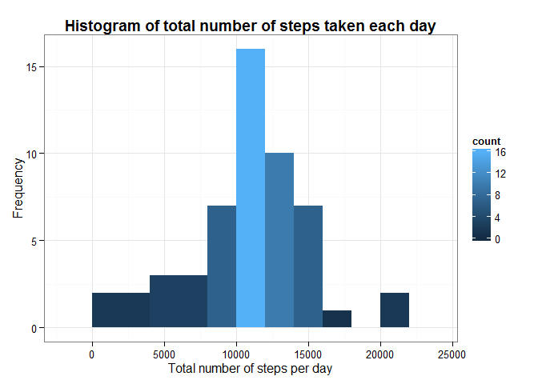
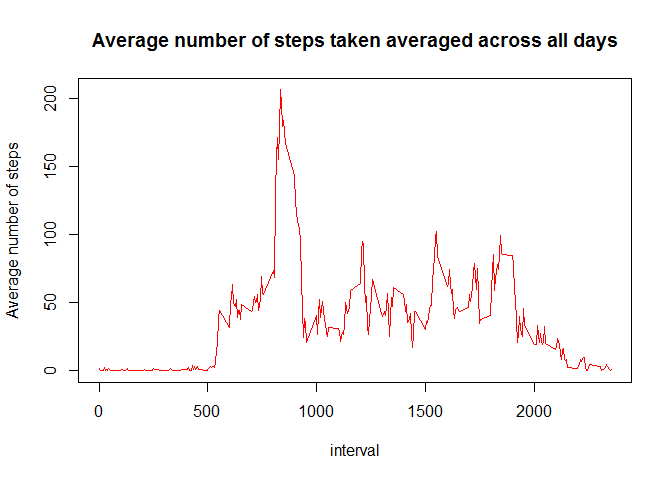
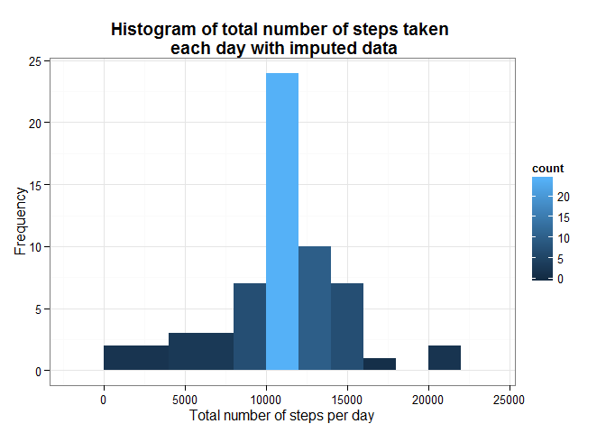
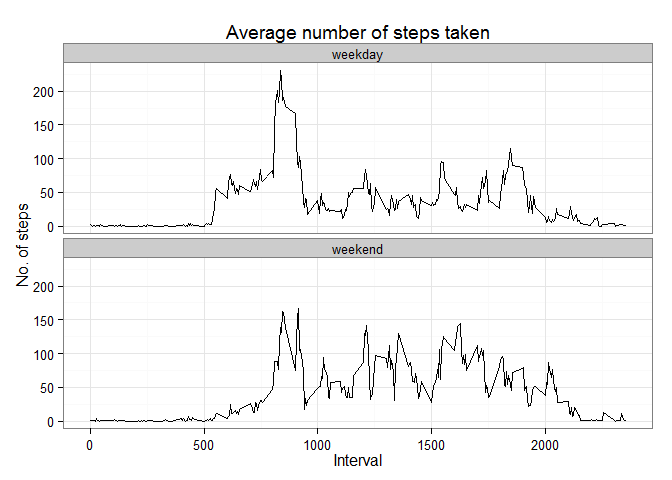

# Reproducible Research: Peer Assessment 1
By: Huang Yinning

## Loading and preprocessing the data
First, load the necessary libraries and set the following global options. 


```r
library(knitr)
library(dplyr,warn.conflicts=FALSE)
library(ggplot2)

opts_chunk$set(echo=TRUE, results="hold")
```

Then, load the activity dataset using `read.csv()` function and convert the data type of the respective columns.


```r
act <- read.csv("./activity/activity.csv")
act$date <- as.Date(act$date)
act$steps <- as.numeric(act$steps)
```

Print the structure of the dataframe using `str()` function.


```r
str(act)
```

```
## 'data.frame':	17568 obs. of  3 variables:
##  $ steps   : num  NA NA NA NA NA NA NA NA NA NA ...
##  $ date    : Date, format: "2012-10-01" "2012-10-01" ...
##  $ interval: int  0 5 10 15 20 25 30 35 40 45 ...
```

## What is mean total number of steps taken per day?

We first calculate the total number of steps taken per day. NA values are ignored using `na.omit()` before applying functions, `group_by()` and `summarise()` from the `dplyr` package to create a new dataframe, `act_sumByDay`. 


```r
act_sumByDay <- act %>% na.omit() %>% group_by(date) %>% summarise(totalsteps = sum(steps))
```

We plot a histogram of the total number of steps taken per day to show the distribution using `ggplot` from `ggplot2` package.


```r
histPlot <- ggplot(act_sumByDay, aes(x=totalsteps)) + geom_histogram(aes(fill = ..count..), binwidth=2000) +
            theme_bw() +
            labs(x="Total number of steps per day", y="Frequency") +
            ggtitle("Histogram of total number of steps taken each day") +
            theme(plot.title = element_text(face="bold"))

print(histPlot)
```

 

Then we calculate the mean and median of the total number of steps taken per day.


```r
meanSteps <- mean(act_sumByDay$totalsteps)
medianSteps <- median(act_sumByDay$totalsteps)
```

```r
meanSteps
```

```
## [1] 10766.19
```

```r
medianSteps
```

```
## [1] 10765
```
## What is the average daily activity pattern?

We calculate the mean number of steps taken for each 5 mins interval using `group_by()` and `summarise()` functions from `dplyr` package and store the results in a new dataframe, `act_avgDailyActivity`. NA values are ignored using `na.rm=TRUE` option in the `mean()` function.


```r
act_avgDailyActivity <- act %>% group_by(interval) %>% summarise(meansteps = mean(steps, na.rm=TRUE))
```

To show the average daily activity pattern, we show a time series plot of the 5-minute interval (x-axis) and the average number of steps taken, averaged across all days (y-axis). 


```r
with(act_avgDailyActivity, plot(interval, 
                                meansteps, 
                                type="l", 
                                main="Average number of steps taken averaged across all days", 
                                ylab="Average number of steps", 
                                col=2))
```

 

`which.max()` function is used to identify the 5-minute interval that contains the highest average number of steps taken.


```r
maxMeanInterval <- act_avgDailyActivity[which.max(act_avgDailyActivity$meansteps),]$interval
```

Hence, the 5-minute interval that has the highest average numver of steps taken is 835.

## Imputing missing values

First, we calculate the number of rows that contains "NA" using `sum()` and `is.na()` function simuntaneously.


```r
numNA <- sum(is.na(act$steps))
```

The total number of missing values in the dataset is 2304. 

Then, we use the average number of steps taken in that 5-minute interval to impute any missing values (NA) in the dataset. This is done by using the dataframe, `act_avgDailyActivity` that contains average number of steps taken, averaged across all days for each 5-minute interval.


```r
impute <- act %>% 
    left_join(act_avgDailyActivity, by="interval") %>% 
    mutate(steps=ifelse(is.na(steps), meansteps, steps))

impute <- impute[,-4]
```

After filling in the missing values in the dataset, we plot the same histogram showing the distribution of total number of steps taken per day, and calculate the mean and median of the total number of steps taken per day.


```r
impute_sumByDay <- impute %>% group_by(date) %>% summarise(totalsteps = sum(steps))

imputeHistPlot <- ggplot(impute_sumByDay, aes(x=totalsteps)) + geom_histogram(aes(fill = ..count..), binwidth=2000) +
    theme_bw() +
    labs(x="Total number of steps per day", y="Frequency") +
    ggtitle("Histogram of total number of steps taken \n each day with imputed data") +
    theme(plot.title = element_text(face="bold"))

print(imputeHistPlot)
```

 


```r
imputeMeanSteps <- mean(impute_sumByDay$totalsteps)
imputeMedianSteps <- median(impute_sumByDay$totalsteps)
```


```r
imputeMeanSteps
```

```
## [1] 10766.19
```


```r
imputeMedianSteps
```

```
## [1] 10766.19
```

The difference in mean is 0 and the difference in median is -1.1886792. 

## Are there differences in activity patterns between weekdays and weekends?

We first create a new factor variable, `day` using `mutate()` function from `dplyr` package and `weekdays()` function suggested by the assignment in the `impute` dataframe.


```r
impute <- impute %>% 
    mutate(day=ifelse(weekdays(date) %in% c("Saturday", "Sunday"), "weekend", "weekday"))
impute$day <- as.factor(impute$day)
```

Then we make a panel plot containing a time series plot of the 5-minute interval (x-axis) and the average number of steps taken, averaged across all weekday days or weekend days (y-axis)


```r
impute_weekday <- impute %>% group_by(interval,day) %>% summarise(meansteps=mean(steps))

qplot(interval, meansteps, 
      data=impute_weekday, geom=c("line"), 
      main="Average number of steps taken", 
      xlab="Interval", ylab="No. of steps") + 
    facet_wrap(~day, ncol=1) + theme_bw()
```

 
